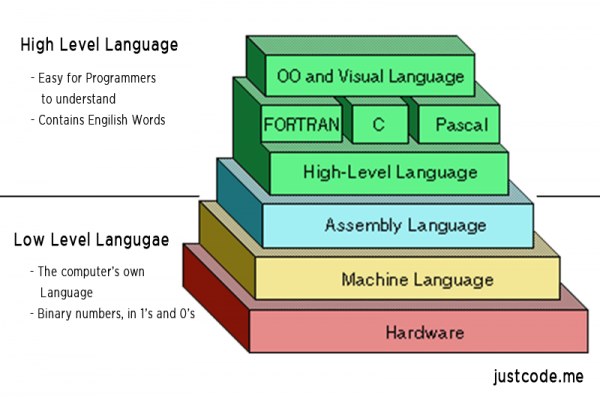
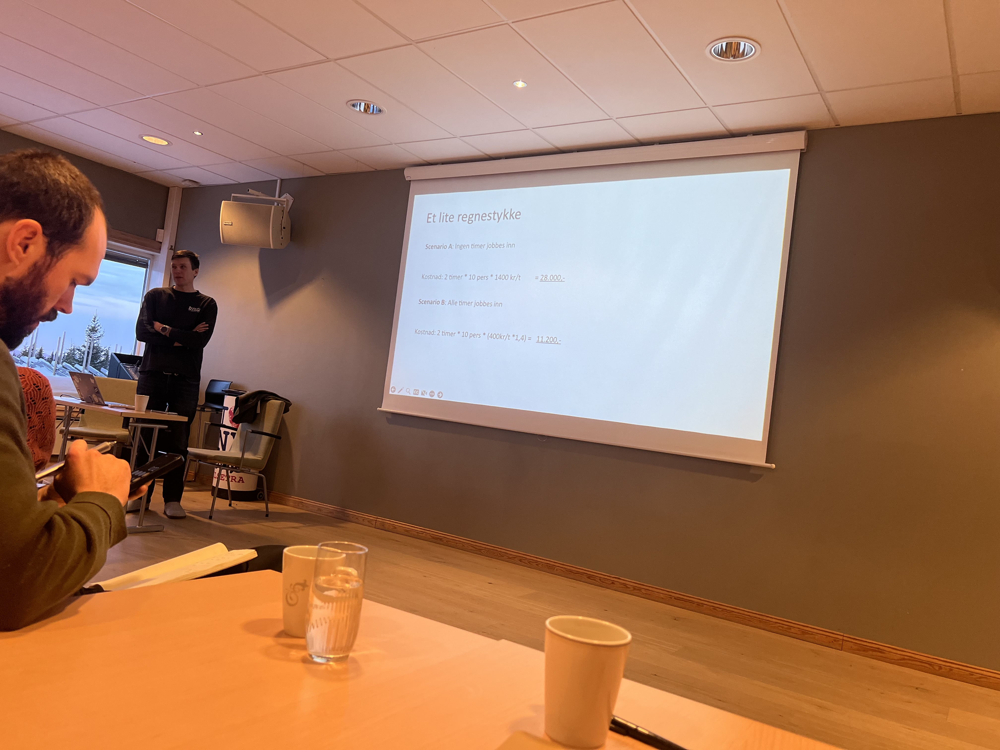
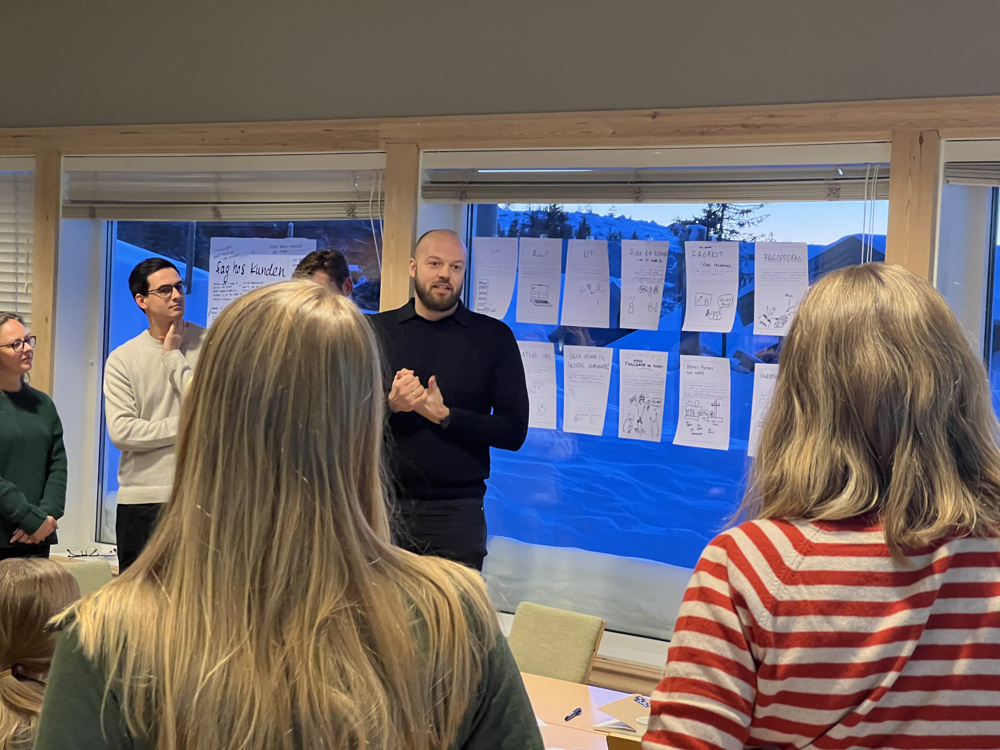
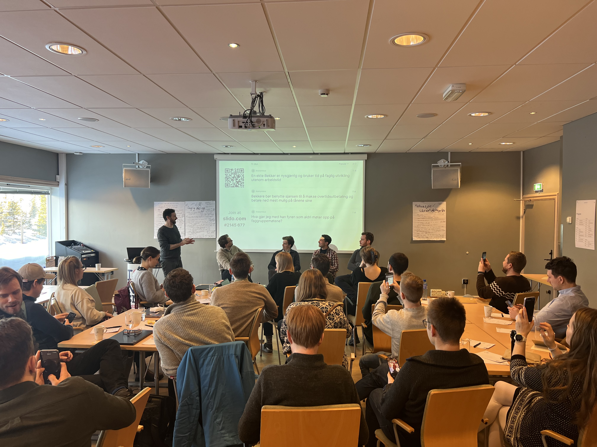
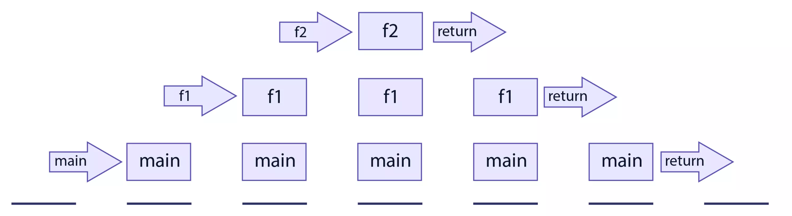
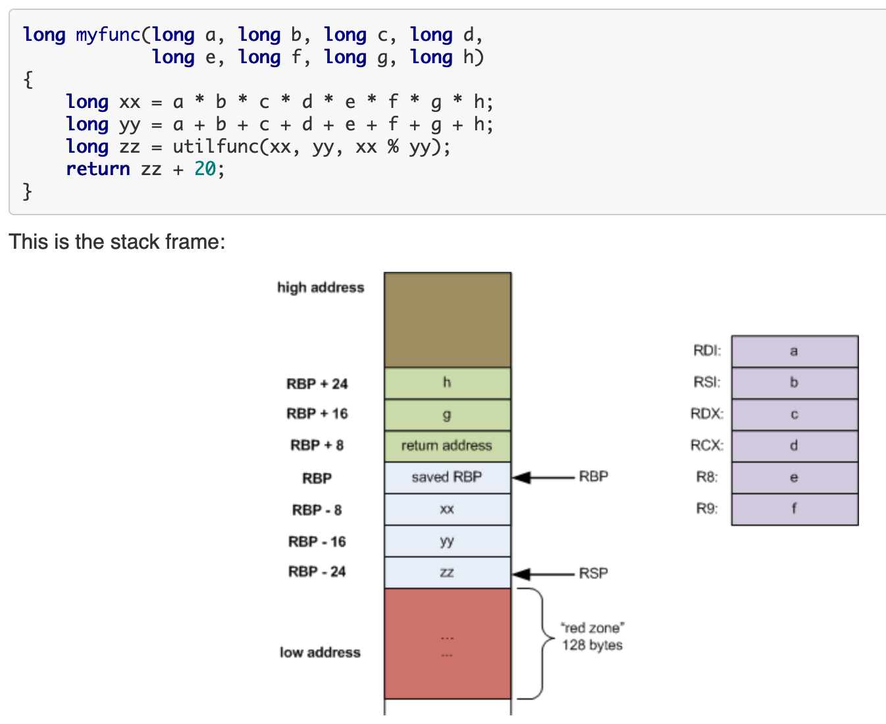

---

# Faggruppemøte februar 2024



---

# Agenda

1. Runde rundt bordet
2. Check-in frå fagleiarsamling
3. Kort prat om tiltak
4. Planleggings
5. Det gøye

---

# Runde rundt bordet

---

# Check-in frå fagleiarsamling



---

# Check-in frå fagleiarsamling



---

# Check-in frå fagleiarsamling



---

# Check-in frå fagleiarsamling


---

# Kort prat om tiltak

TODO: Tekst?

---
[.autoscale: true]

# Planleggings

* Hastighetskonkurranse: 8 ✅
* **Forstå lavnivå sikkerhetsfeil: 6**
* Lære mer om Rust: 6 ✅
* WASM: 6
* **Reverse engineering: 5**
* DIY Bootloader: 3
* Battle of the lavnivå programmeringsspråk (Sammenligne lavninå programmeringsspråk): 3
* Hvor ineffektiv er høynivå kode: 2
* Raspberry strømforbruk: 1
* Performant C#: 1
* Zig: 1
* Vise frem noe man har laget: 1
* Compiler/interpreter: 1
* Lavnivå CTF: 1

---

# Det gøye

Vi skal prøve oss på litt binary exploitation og litt reverse engineering

---

# Opplegg

Vi begynner med å gjere nokre oppgåver i fellesskap, og samtidig gå gjennom litt teori og praktisk informasjon.

**Formål:**
At de får gjere den kjekke delen der ein finner ut korleis løyse oppgåva utan å måtte bruke timesvis på knoting.

---

# Oppgåve 1 - clutter-overflow

| Clutter, clutter everywhere and not a byte to use.

nc mars.picoctf.net 31890

---
[.autoscale: true]

# clutter-overflow


```c
#include <stdio.h>
#include <stdlib.h>

#define SIZE 0x100
#define GOAL 0xdeadbeef

const char* HEADER = "<klipt vekk fordi den tok mykje plass";

int main(void)
{
  long code = 0;
  char clutter[SIZE];

  setbuf(stdout, NULL);
  setbuf(stdin, NULL);
  setbuf(stderr, NULL);

  puts(HEADER);
  puts("My room is so cluttered...");
  puts("What do you see?");

  gets(clutter);


  if (code == GOAL) {
    printf("code == 0x%llx: how did that happen??\n", GOAL);
    puts("take a flag for your troubles");
    system("cat flag.txt");
  } else {
    printf("code == 0x%llx\n", code);
    printf("code != 0x%llx :(\n", GOAL);
  }

  return 0;
}

```

---

# clutter-overflow

```sh
man gets
```

---

# clutter-overflow



---

# clutter-overflow



---

# clutter-overflow

## Løysing

```c
----------------------TOPP
char[] clutter
...
...
----------------------
long code
----------------------
saved RBP
----------------------
return address
----------------------
locals of calling function
```

`clutter` har storleik 0x100 = 256, så må minst ha så mange tegn for å overflowe

---

# Sette opp eit køyremiljø

```
brew install colima
```

```
colima start --cpu 2 --memory 4 --disk 50 --arch x86_64 --mount-type virtiofs
colima start --cpu 2 --memory 8 --disk 50 --arch x86_64 --vm-type vz --vz-rosetta --mount-type virtiofs
colima start --cpu 2 --memory 8 --disk 50 --arch x86_64 --cpu-type max --mount-type virtiofs
colima start --cpu 2 --memory 8 --disk 50 --arch x86_64 --cpu-type max --vm-type qemu --mount-type 9p
```

```
./start-docker.sh
```

```
sudo apt-get update
```

```
sudo apt-get binutils
```

---

---

Anna kul oppgåve:
https://play.picoctf.org/practice/challenge/258?category=6&page=2
